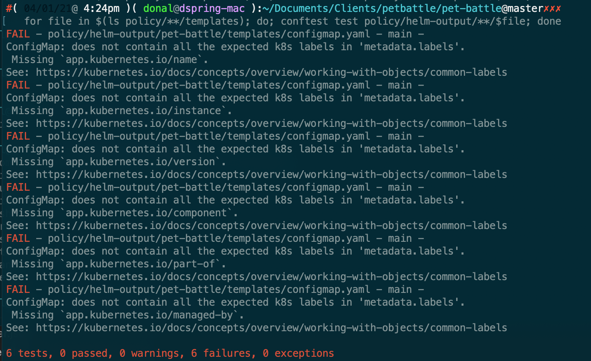

## Simple policy

- [Rego Policy playground](https://play.openpolicyagent.org/) - language our policies are written in, this is a great place to test them out.
- [conftest](https://www.conftest.dev/) - Bash utility for validating yaml against the Rego Policies.

1. Install conftest
2. `helm template pb-test chart --output-dir policy/helm-output`
3. `for file in $(ls policy/**/templates); do; conftest test policy/helm-output/**/$file; done`

